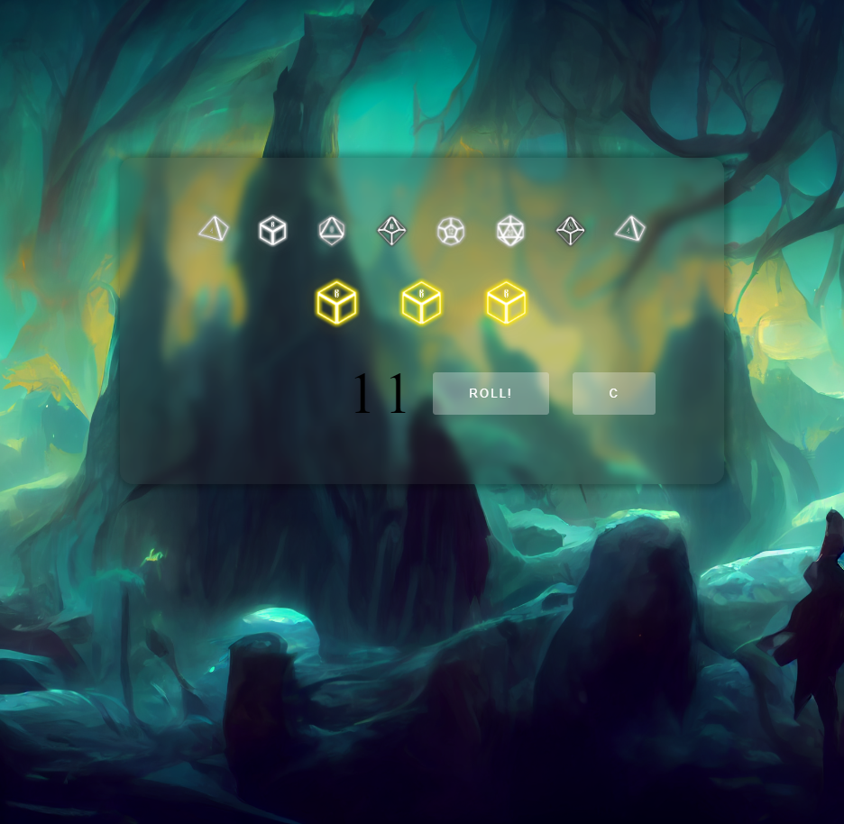

# d20

A dice rolling interface consisting of d4, d6, d8, d10, d12, d20, percentile, and coin.

## Screen Grab (768px)

Alpha version displaying static dice, selected dice, and roll total

## Built With

* [HTML](https://developer.mozilla.org/en-US/docs/Web/HTML)
* [CSS](https://developer.mozilla.org/en-US/docs/Web/CSS)
* [JavaScript](https://javascript.com)

## Deployed Link

* [Live Page](https://rev1311.github.io/d20)

## Authors

* **Michael Partin**

* [Link to Github](https://github.com/rev1311)
* [Link to LinkedIn](https://linkedin.com/in/michael-partin)

See also the list of [contributors](https://github.com/your/project/contributors) who participated in this project. HINT: Just me.

## Acknowledgments

* Thanks to Valeshka for the icon art & design feedback, and MidJourney for background images
